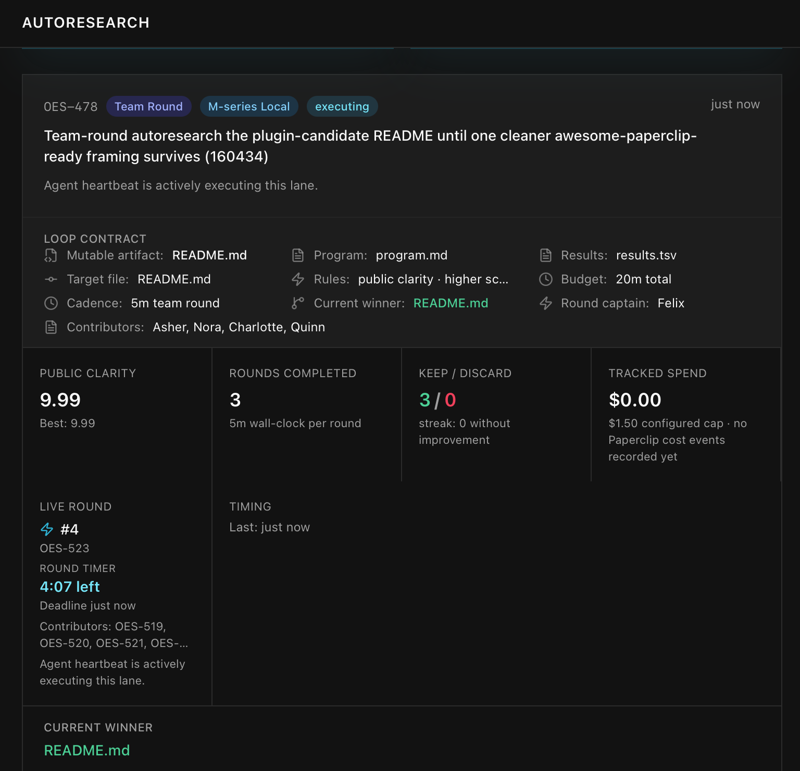
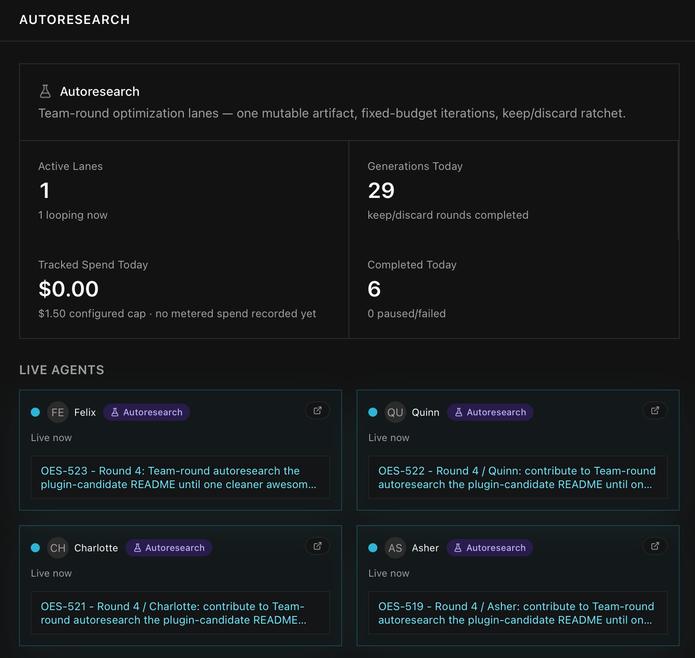
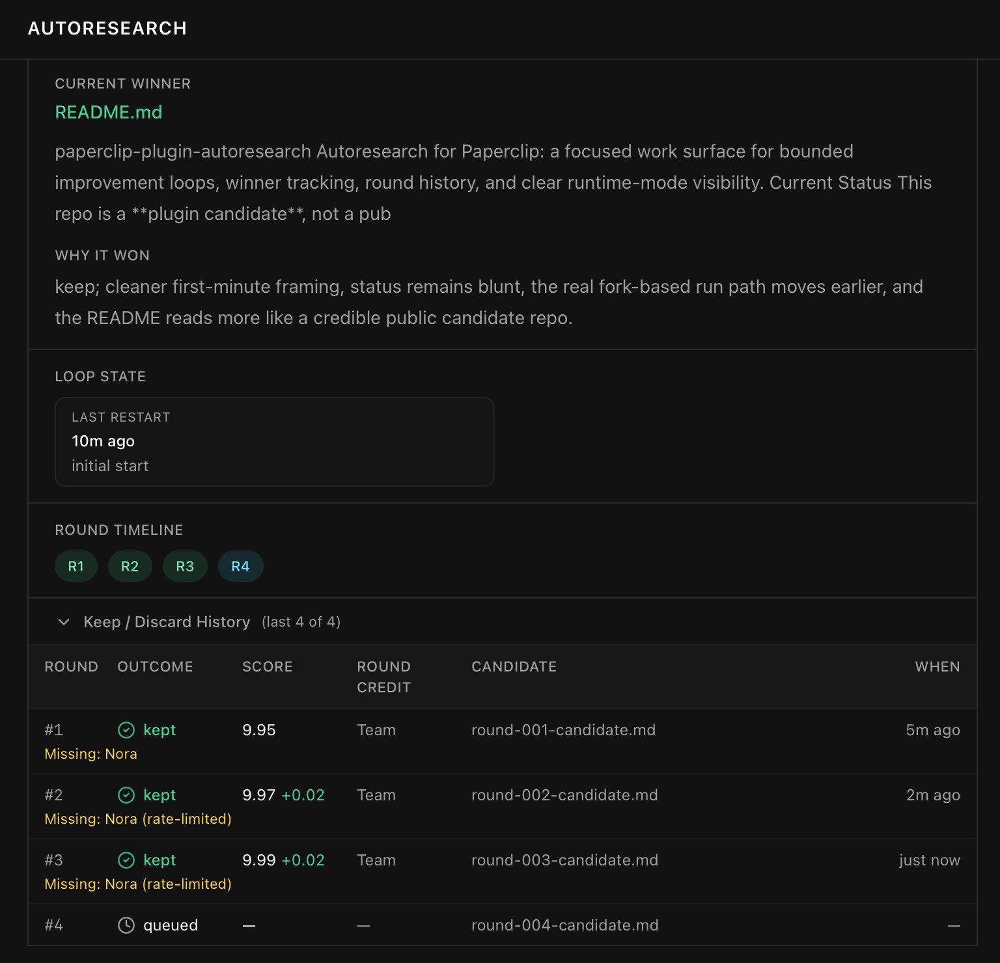

# paperclip-plugin-autoresearch

Autoresearch for Paperclip: a focused work surface for bounded improvement loops, winner tracking, round history, and clear runtime-mode visibility.

## Current Status

This repo is a **plugin candidate**, not a published standalone plugin.

What is true today:

- the Autoresearch feature works today inside a Paperclip source checkout
- the Paperclip-facing boundary is clean enough to package
- the standalone plugin runtime is still the missing piece

If you want the honest one-line version: **the product experience exists today; the installable plugin package does not yet.**

## Screenshots

### Live lane



### Live agents



### Winner and history



## Why It Exists

Autoresearch gives Paperclip a native place to run bounded improvement work on a single mutable artifact.

Instead of spreading this across ad hoc scripts and notes, it keeps the loop visible in the same system where teams already manage issues, runs, budgets, and review.

## What You Get

- an `Autoresearch` page inside `Work`
- bounded local team-round loops
- round history and timeline
- current winner preview
- contributor notes and why-it-won context
- runtime-mode labels and controls
- explicit local-vs-upstream status

## What Works Today

- `Autoresearch` page
- live badges in the main Paperclip UI
- `M-series Local` mode on Apple Silicon
- winner tracking
- keep/discard round history
- round-level contributor notes
- Settings controls for runtime modes

## Reference Implementation

This repo is intentionally scoped to the Autoresearch feature only.

The current reference files are included here:

- `reference/ui/Autoresearch.tsx`
- `reference/ui/AutoresearchPanel.tsx`
- `reference/runtime/paperclip_autoresearch_runner.py`

They show the current page/runtime shape without dragging in unrelated Paperclip work.

## Runtime Modes

| Mode | Meaning | Current state |
| --- | --- | --- |
| `M-series Local` | Paperclip-native local mode for Apple Silicon testing. | Working now |
| `Actual Upstream (CUDA)` | Exact upstream `karpathy/autoresearch` on external NVIDIA/CUDA compute, synced back into Paperclip. | Planned |

## Install Story Today

Until the Paperclip plugin runtime lands, Autoresearch runs inside a Paperclip source checkout:

```bash
pnpm install
pnpm -r typecheck
pnpm --filter @paperclipai/server prepare:ui-dist
pnpm --filter @paperclipai/server dev --port 3100
```

Then open:

- `Work -> Autoresearch`
- `Settings -> Scheduler Heartbeats -> Autoresearch`

## Configuration

Current runtime controls live in Paperclip Settings.

| Setting | Description |
| --- | --- |
| `Enable Actual Upstream (CUDA)` | Allows lanes that read real upstream CUDA-backed Autoresearch state. |
| `Enable M-series Local` | Allows the Apple Silicon-compatible local mode on this machine. |

## How The Loop Works

1. choose one mutable artifact
2. run a bounded round
3. collect contributor notes
4. keep one surviving candidate
5. write round history
6. continue until the stop rule or time budget is reached

The local implementation already writes the same classes of artifacts you would want to inspect in a real Autoresearch lane:

- `program.md`
- `results.tsv`
- round candidates
- round memos
- contributor notes

## Packaging Boundary

The intended split is:

- **plugin-owned UI**
  - `Autoresearch` Work page
  - Autoresearch panel and display components
- **shared Paperclip contracts**
  - autoresearch display state
  - dashboard summary payloads
  - issue experiment contracts
- **host/core responsibilities**
  - issue lifecycle
  - heartbeat persistence
  - approvals
  - budgets
  - routing
- **local-only runtime glue**
  - local runner scripts
  - local wake/orchestration logic
  - Apple Silicon fallback harnesses

More detail is in [docs/BOUNDARY.md](./docs/BOUNDARY.md).

## Known Limitations

- not yet a standalone installable plugin package
- exact upstream CUDA mode still needs external NVIDIA/CUDA compute
- local Apple Silicon mode proves the control surface and workflow, not the full upstream training runtime
- final packaging still depends on the Paperclip plugin runtime landing upstream

## Why This Could Belong In `awesome-paperclip`

The case for this project is simple:

- it extends Paperclip without creating a second system
- it keeps issues, governance, and review in the same surface
- it already has a truthful working story today
- it has a clear path from candidate to real plugin once the runtime exists

## Road To A Real Standalone Plugin

1. land the Paperclip plugin runtime
2. split the Autoresearch UI and shared contracts into a standalone package
3. keep local runner glue outside the reusable plugin
4. publish the repo
5. submit it to `awesome-paperclip`

## License

MIT

## Related Docs

- [docs/BOUNDARY.md](./docs/BOUNDARY.md)
- [docs/AWESOME_PAPERCLIP.md](./docs/AWESOME_PAPERCLIP.md)
- [docs/BENCHMARK.md](./docs/BENCHMARK.md)
